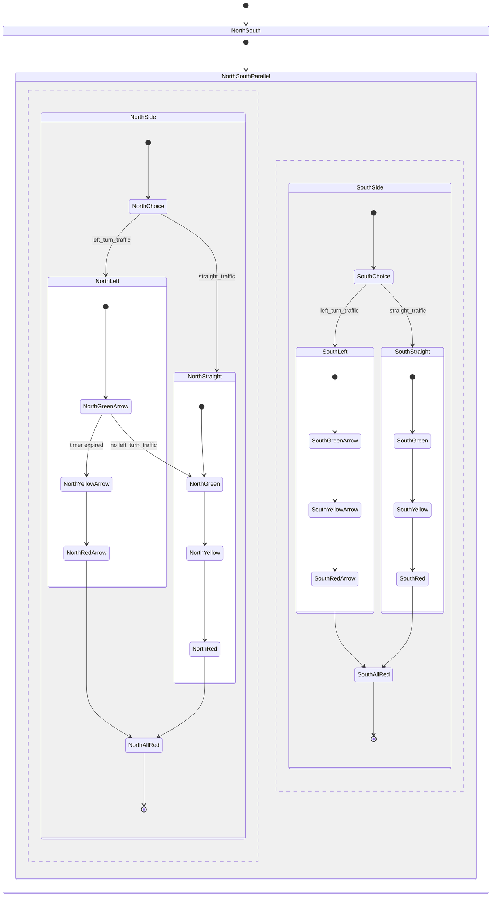

# State Charts

State Charts (sometimes referred to as [Harel Statecharts](https://en.wikipedia.org/wiki/State_diagram#Harel_statechart)) build upon the _state machine_ concept by adding hierarchy, concurrency, and communication.  

A traditional state machine allows for a single state to be active at a time.  A good example is a simple 3 light traffic light.  The traffic light can be in one of three states: red, yellow, or green.  The traffic light can only be in one state at a time.  The traffic light can transition from one state to another based on a set of rules.  For example, the traffic light can transition from red to green when the timer expires or when a pedestrian presses the button.  

State charts allow for multiple states to be active at a time.  This is useful for modeling complex systems.  For example, a traffic light with a left turn signal.  The traffic light can start by turning on both the left turn signals until a weight sensor in the road no longer detects cars in one of the left turn lanes.  At which point the empty lanes turn signal is turned off AND the main light for that direction turns green.  A timer ensures that the opposite left turn lain transitions to red after 30 seconds to ensure that traffic flowing in opposite directions can also flow.

This control flow can be represented by the following state chart:

Each direction has two states, one for left turn traffic and one for straight traffic.  Each of these states has three states, one for each lamp in the signal.  For each each signal, the states of the left and straight traffic are independent of each other and operate in parallel.  State charts allow this to happen by tracking the straight and left signal states independently.  

So when the there is no traffic, the signal can determine to allow the straight traffic to flow even before the left turn timer has expired.

## Components

State Charts are made up of a number of building block components which are combined together to make up the overall behavior of the system.

### States

**States** are the safe landing spaces for the machine. These represent where the machine is in the process and also provide instructions on where the machine can go next.

States can come in a couple of forms:

- **Atomic States** are the simplest form of state.  They represent a single point in the process and have no child states.  
- **Compound States** are made up of other states.  They represent a group of related states and can contain any number of child states.
- **Final States** are a special type of atomic state that represent the end of a process.  Once the machine reaches a final state, it cannot transition to any other state.
- **Parallel States** are a special type of compound state that allow for multiple child states to be active at the same time.  Parallel states are useful for modeling systems that have multiple independent processes that need to be tracked.

#### Mounting & Unmounting

When a state is entered, it is said to be _mounted_.  When a state is exited, it is said to be _unmounted_.  When a state is mounted, it will execute any `onentry` behavior.  When a state is unmounted, it will execute any `onexit` behavior.  These allow us to control how the system behaves when it enters and exits a particular state.

### Transitions

**Transitions** are the arrows that connect states together.  They represent the possible paths that the machine can take.  Transitions can be triggered by a number of different events, including timers, user input, and external events.
