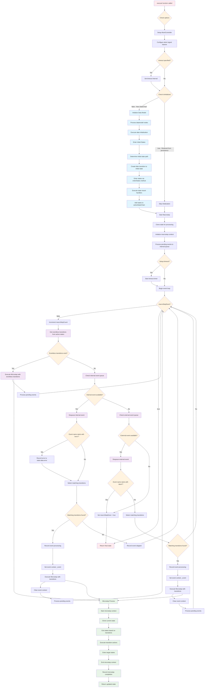

# Full StateChart Execution Flow

```mermaid
flowchart TD
    A[execute function called] --> B{Check options}
    B --> C[Setup AbortController]
    C --> D[Configure abort signal listener]
    D --> E{timeout specified?}
    E -->|Yes| F[Set timeout interval]
    E -->|No| G{Check isInitialized}
    F --> G
    
    G -->|false - New StateChart| H[Initialize Data Model]
    G -->|true - Restored from persistence| M[Skip initialization]
    
    H --> I[Process datamodel nodes]
    I --> J[Execute data initialization]
    J --> K[Enter Initial States]
    K --> L[Determine initial state path]
    L --> N[Create fake transition to initial state]
    N --> O[Enter states via enterStates method]
    O --> P[Execute state mount handlers]
    P --> Q[Add states to activeStateChain]
    
    M --> R[Start Macrostep]
    Q --> R
    
    R --> S[Clone state for processing]
    S --> T[Initialize macrostep context]
    T --> U[Process pending events to internal queue]
    U --> V{Setup timeout?}
    V -->|Yes| W[Start timeout timer]
    V -->|No| X[Begin event loop]
    W --> X
    
    X --> Y{macroStepDone?}
    Y -->|false| Z[Increment macroStepCount]
    Y -->|true| END[Return final state]
    
    Z --> AA[Get eventless transitions from active states]
    AA --> BB{Eventless transitions exist?}
    BB -->|Yes| CC[Execute Microstep with eventless transitions]
    BB -->|No| DD[Check internal event queue]
    
    CC --> EE[Process pending events]
    EE --> Y
    
    DD --> FF{Internal event available?}
    FF -->|Yes| GG[Dequeue internal event]
    FF -->|No| HH[Check external event queue]
    
    GG --> II{Event name starts with 'error'?}
    II -->|Yes| JJ[Record error to state.data.error]
    II -->|No| KK[Select matching transitions]
    JJ --> KK
    
    KK --> LL{Matching transitions found?}
    LL -->|Yes| MM[Record event processing]
    LL -->|No| NN[Record event skipped]
    
    MM --> OO[Set event context _event]
    OO --> PP[Execute Microstep with transitions]
    PP --> QQ[Clear event context]
    QQ --> RR[Process pending events]
    RR --> Y
    
    NN --> Y
    
    HH --> SS{External event available?}
    SS -->|Yes| TT[Dequeue external event]
    SS -->|No| UU[Set macroStepDone = true]
    
    TT --> VV{Event name starts with 'abort'?}
    VV -->|Yes| UU
    VV -->|No| WW[Select matching transitions]
    
    WW --> XX{Matching transitions found?}
    XX -->|Yes| YY[Record event processing]
    XX -->|No| Y
    
    YY --> ZZ[Set event context _event]
    ZZ --> AAA[Execute Microstep with transitions]
    AAA --> BBB[Clear event context]
    BBB --> CCC[Process pending events]
    CCC --> Y
    
    UU --> END
    
    %% Microstep subprocess
    CC --> MICRO[Microstep Process]
    PP --> MICRO
    AAA --> MICRO
    
    MICRO --> DDD[Start microstep context]
    DDD --> EEE[Clone current state]
    EEE --> FFF[Exit states based on transitions]
    FFF --> GGG[Execute transition actions]
    GGG --> HHH[Enter target states]
    HHH --> III[End microstep context]
    III --> JJJ[Record microstep completion]
    JJJ --> KKK[Return updated state]
    
    %% Styling
    classDef initProcess fill:#e1f5fe
    classDef eventProcess fill:#f3e5f5
    classDef microstepProcess fill:#e8f5e8
    classDef decision fill:#fff3e0
    classDef endpoint fill:#ffebee
    
    class H,I,J,K,L,N,O,P,Q initProcess
    class AA,BB,CC,DD,FF,GG,HH,SS,TT eventProcess
    class MICRO,DDD,EEE,FFF,GGG,HHH,III,JJJ,KKK microstepProcess
    class B,E,G,V,Y,BB,FF,II,LL,SS,VV,XX decision
    class A,END endpoint
```

