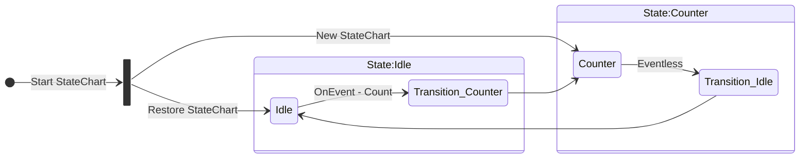

# Basic Counter Example with Data Persistence

> ### Tutorial is great if you are trying to learn:
> 1. About the different types of transitions
> 2. About StateChart with no defined conclusion
> 3. How to build your application around the StateChart's stable states
> 4. How persistence can be used to "resume" the state of a StateChart across multiple executions


The "Basic Counter" demo.  Next to the "_Hello World_" demo this is everyone's favorite demo to produce.  "Lets increment a number by one every time the thing runs.".  This example shows how the 

<div align="center">


</div>


This demo importantly shows off the following features of the StateCharts:

- Loading from persistent storage
- Event Driven & Eventless transitions

## Give it a Try

To give this example, a try you can use the TSX library to run the `index.ts` file.

```sh
npx tsx docs/examples/basic-counter/index.ts
```

This will execute a script which takes the following actions:

1. Check for a persistence file (`counter-data.json`)
2. Load the StateChart XML from disk
3. Initialize the StateChart (with existing data, if present from step 1)
4. Push a `count` event to the StateChart's queue
5. Start the StateChart
6. Once the StateChart is "stable", display the new state (no more events in the queue and all transitions settled)
7. Save the StateChart state back to the persistence file (`counter-data.json`)

In your terminal you should see the following output:

```
🔢 Basic Counter Example with Data Persistence
==================================================
📖 Reading existing counter data from file...

⚙️  Executing statechart...
[2025-10-31T14:33:11.283Z] [info] Counter state entered. Current count: 8
[2025-10-31T14:33:11.286Z] Counter incremented to: 8 at 2025-10-31T14:33:11.285Z
[2025-10-31T14:33:11.286Z] [Info] System is Idle

✅ Statechart execution completed

📊 Updated Counter Data:
   Count: 9
   Last increment: 2025-10-31T14:33:11.285Z
   Total executions: 9

💾 Counter data saved to: /Users/thomaskottke/Repos/Libraries/statecharts/docs/examples/basic-counter/counter-data.json

🎉 Counter incremented by 1!

Run this command again to increment the counter further.
```

You will then be prompted to run the script again and by typing `y` you will run it again and once more increment the counter.  

```
🔄 Run counter again? (y/N): n
```

## The StateChart

**Full Statechart**: [Link](./statechart.xml)

As shown in the diagram, this StateChart is built using 2 discrete states: `idle` which waits for events and `counter` which increments the counter.

```xml
<scxml>
  <state id="idle">
    <!-- Main counter state -->
  </state>

  <state id="counter">
    <!-- Increments the counter, then returns to the Idle state -->
  </state>
</scxml>
```

In our StateChart file we outline those states using `<state>` tags and give each an `id` attribute (so they can be targeted by transitions).

### Datamodel

Next we define what our data model looks like.  This is not required but ensures that the data used inside of the StateChart is consistent.  Since we are using the `ecmascript` data model (which allows us to execute simple Javascript expressions), we can use the `expr` attribute on each data node to first check if the `data` object (which maintains the state data) contains each value and default it if it does not. 

```xml
<scxml datamodel="ecmascript">
  <datamodel>
    <!-- Counter value -->
    <data id="count" expr="0" />
    <!-- Timestamp of last increment -->
    <data id="lastIncrement" expr="null" />
    <!-- Total number of executions -->
    <data id="totalExecutions" expr="0" />
  </datamodel>

  <!--States -->
  <state id="idle">...</state>
  <state id="counter">...</state>
</scxml>
```

You can think of this like writing normal code in that we are defining variables that the StateChart can access:

```ts
const data = {}

const count = data.count ?? 0;
const lastIncrement = data.lastIncrement ?? null
const totalExecutionsn = data.totalExecutions ?? 0;
```

This configuration outlines that we have 3 variables:

- A **Count** to hold the value that we increment each time the script runs
- A **Last Increment** to track when the increment happened
- A **Total Executions** to track how many times we have incremented the counter

> Note: Data Access
> When accessing values within the StateChart, make sure that you are either pulling values from the `data.*` or `_event.*` variables.  These specifically reference locations in the internal state that are available to the operations inside of the StateChart.

Importantly, there `<datamodel>` node is only processed when a _new_ StateChart is created.  StateCharts restored using persistence data does ignores the global `<datamodel>` and `<data>` nodes.

### Transitions

On it's own, our StateChart wont do much.  When we start a brand new instance of our StateChart (by calling `StateChart.fromXML`), the system looks for the `<scxml initial=""></scxml>` (or via the `<initial>` node).  However after you run the StateChart once, it will stay in that state forever.

#### Transition - Stablize

To switch between states we use `<transition>` nodes.  Each node takes a `target=` attribute which defines which state to move to when this transition executes.  Below you will see we added the `<transition target="idle">` transition to our counter state: 

```xml
<scxml
  xmlns="http://www.w3.org/2005/07/scxml"
  xmlns:xsi="http://www.w3.org/2001/XMLSchema-instance"
  xsi:schemaLocation="../schemas/scxml.xsd"
  version="1.0"
  datamodel="ecmascript"
  initial="counter"
>

  <datamodel>
    <!-- Data Schema Setup -->
  </datamodel>

  <state id="idle"></state>

  <!-- Main counter state -->
  <state id="counter">
    <onentry>
      <log label="Info">System is Counting</log>
      <log label="info" expr="'Counter state entered. Current count: ' + data.count" />
    </onentry>

    <transition target="idle">
       <!-- Update timestamp -->
      <assign location="lastIncrement" expr="new Date().toISOString()" />

      <log expr="'Counter incremented to: ' + data.count + ' at ' + data.lastIncrement" />

      <!-- Increment the counter -->
      <assign location="count" expr="data.count + 1" />
    </transition>
  </state>
<scxml>
```

When the statechart starts executing with this transition in place, here's exactly what happens:

1. Initial State Entry
The statechart begins by entering the counter state (since initial="counter" is set on the root <scxml> element). As it enters this state, the <onentry> actions execute first, logging the current counter value.

2. Automatic Transition Execution
Here's the key behavior: immediately after entering the counter state, the statechart detects the eventless transition and executes it automatically. This happens because the transition has no event attribute - making it an "eventless transition" that fires as soon as the state becomes active.

3. Transition Actions Execute
    - During the transition from counter to idle, all the executable content inside the <transition> element runs in sequence:
    - Updates the lastIncrement timestamp
    - Logs the increment message
    - Finally increments the actual count value
  
4. Target State Entry - After all transition actions complete, the statechart moves to the idle state and executes its <onentry> actions (logging "System is Idle").

5. Statechart Becomes Stable
With no more eventless transitions available and no events in the queue, the statechart reaches a stable state and stops executing.

The Important Insight: This eventless transition (see [Moving Between States](/docs/Moving%20Between%20States.md) for more details) creates an automatic "execute and exit" behavior. The counter state never stays active - it immediately processes the counter increment and transitions to idle. This pattern is perfect for states that represent actions rather than waiting conditions.

Without this transition, the statechart would enter the counter state and remain there indefinitely, never incrementing the counter or moving to another state.


#### Transition - Trigger

Up to this point, our StateChart will execute once (setting `data.count` to **1**).  The _stable_ state will be set to _Idle_ because of the eventless transition in the _Counter_ state.  If we re-run the StateChart, nothing will happen

```sh
> npx tsx docs/examples/basic-counter/index.ts

🔢 Basic Counter Example with Data Persistence
==================================================
📖 Reading existing counter data from file...

⚙️  Executing statechart...
[2025-10-31T14:33:11.283Z] [info] Counter state entered. Current count: 8
[2025-10-31T14:33:11.286Z] Counter incremented to: 8 at 2025-10-31T14:33:11.285Z
[2025-10-31T14:33:11.286Z] [Info] System is Idle

✅ Statechart execution completed

📊 Updated Counter Data:
   Count: 1
   Last increment: 2025-10-31T14:33:11.285Z
   Total executions: 1

💾 Counter data saved to: /Users/thomaskottke/Repos/Libraries/statecharts/docs/examples/basic-counter/counter-data.json

🎉 Counter incremented by 1!

Run this command again to increment the counter further.

> npx tsx docs/examples/basic-counter/index.ts

🔢 Basic Counter Example with Data Persistence
==================================================
📖 Reading existing counter data from file...

⚙️  Executing statechart...
[2025-10-31T14:33:11.283Z] [info] Counter state entered. Current count: 8
[2025-10-31T14:33:11.286Z] Counter incremented to: 8 at 2025-10-31T14:33:11.285Z
[2025-10-31T14:33:11.286Z] [Info] System is Idle

✅ Statechart execution completed

📊 Updated Counter Data:
   Count: 1
   Last increment: 2025-10-31T14:33:11.285Z
   Total executions: 1

💾 Counter data saved to: /Users/thomaskottke/Repos/Libraries/statecharts/docs/examples/basic-counter/counter-data.json

🎉 Counter incremented by 0!

Run this command again to increment the counter further.

```

The last thing we need is a way to exit the _Idle_ state and move back to the _Counter_ state.  To do this we define a `<transition>` node inside of our `idle` state:

```xml
<scxml
  xmlns="http://www.w3.org/2005/07/scxml"
  xmlns:xsi="http://www.w3.org/2001/XMLSchema-instance"
  xsi:schemaLocation="../schemas/scxml.xsd"
  version="1.0"
  datamodel="ecmascript"
  initial="counter"
>

  <datamodel>
     <!-- Data Schema Setup -->
  </datamodel>

  <state id="idle">
    <onentry>
      <log label="Info">System is Idle</log>
    </onentry>

    <transition target="counter" event="count">
      <!-- Increment total executions -->
      <assign location="totalExecutions" expr="data.totalExecutions + 1" />
    </transition>
  </state>

  <state id="counter">
    <!-- Main counter state -->
  </state>
<scxml>
```

This transition (unlike the one in the counter) is only triggered when the system receives a _Count_ event.  To trigger that we need to add a _count event_ to the StateChart's queue:

```ts
// Step 4: Trigger state change with an event
stateChart.addEvent({
  name: 'count',
  type: 'external',
  sendid: '',
  origin: '',
  origintype: '',
  invokeid: '',
  data: {}
})

// Step 5: Start processing the events
const result = await stateChart.execute(initialState);
```

Once you call `execute` the StateChart will process this external event, which will instruct it to transition to the target state.  Internally, this will :

1. Exits the current state
   - The _Idle_ state is exited.
2. Triggers any transaction logic
   - The _Total Executions_ is incremented
3. Enters the target state
   -  The _Counter_ state is active

## Conclusion

In this example, we built a simple counter StateChart that demonstrates the core concepts of statechart-driven applications. We covered how to define states and transitions, set up a data model with persistence, and implement both eventless transitions (that execute automatically) and event-driven transitions (that respond to external events). The example showed how to use executable content like `<assign>` and `<log>` elements, handle state entry actions with `<onentry>`, and integrate external events through the `addEvent()` method.

This foundational pattern of alternating between action states (like `counter`) and waiting states (like `idle`) provides the building blocks for more complex statechart applications, demonstrating how statecharts can manage application state, handle events, persist data, and provide predictable, testable behavior patterns.