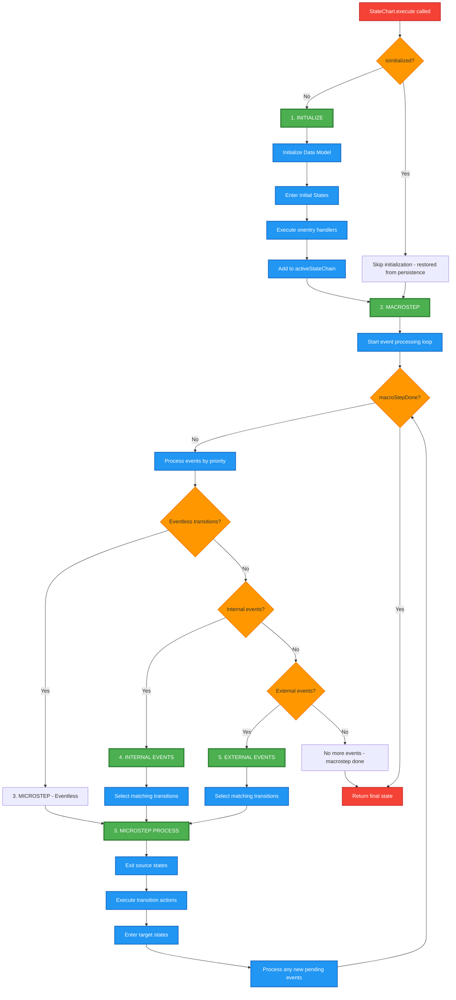

# StateChart API

## StateChart Execution Flow

This diagram focuses on the core execution phases:

1. INITIALIZE (Green)
    - Only runs if isInitialized is false (new StateChart)
    - Initializes the data model from <datamodel> elements
    - Enters initial states and executes their onentry handlers
    - Skipped if StateChart was restored from persistence
2. MACROSTEP (Green)
    - The main event processing loop
    - Continues until no more events or transitions are available
    - Processes events in strict priority order
3. MICROSTEP (Green)
    - The actual state transition execution
    - Exits source states → Executes transition actions → Enters target states
    - Can be triggered by eventless transitions, internal events, or external events
4. INTERNAL EVENTS (Green)
    - Second priority events (after eventless transitions)
    - Generated by the statechart itself (e.g., from <raise> actions)
    - Processed before external events
5. EXTERNAL EVENTS (Green)
    - Lowest priority events
    - Added via addEvent() method
    = Only processed when no eventless transitions or internal events exist